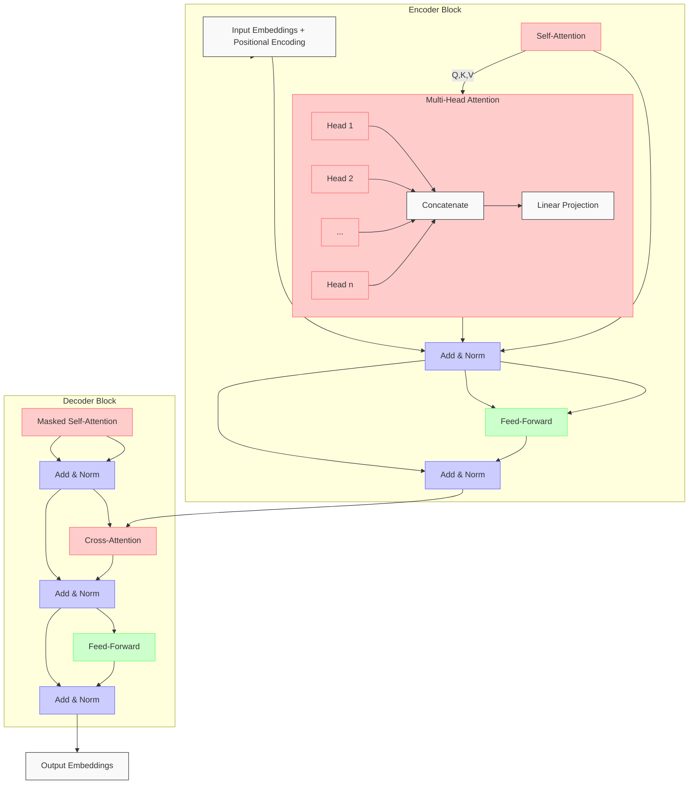

## Transformer
### Architecture
1. Encoder-Decoder Architecture
2. Self-Attention Mechanism
3. Multi-Head Attention
4. Positional Encoding
5. Position-Wise Feed-Forward Networks
6. Layer Normalization
7. Residual Connections

### Encoder-Decoder Architecture
1. Encoder
   - Consists of a stack of identical layers (N layers).
   - Each layer has two sub-layers: multi-head self-attention and position-wise fully connected feed-forward network.
   - Each sub-layer is followed by a residual connection and layer normalization.

### Self-Attention Mechanism

### Multi-Head Attention
1. Why Multi-Head Attention?
   - Allows the model to jointly attend to information from different representation subspaces at different positions.
   - Each head can learn different aspects of the input sequence; Improves the model's ability to capture complex relationships in the data.
2. How it works:
   - The input is projected into multiple sets of queries, keys, and values.
   - Each set is processed independently using the scaled dot-product attention mechanism.
   - The outputs of all heads are concatenated and linearly transformed to produce the final output.

### Layer Normalization
1. Why layer normalization? why not batch normalization?
    - Batch normalization normalizes each dimension of features across batches and the input will be the shape of (batch_size, seq_len, d_model). the seq_len dimension is not fixed and can vary from batch to batch. This makes batch normalization unsuitable for transformer models.
    - Layer normalization normalizes across the all dimensions features for each individual example, making it more suitable for transformer architectures; Helps stabilize and accelerate training by normalizing the inputs to each layer. Reduces internal covariate shift, making the model more robust to changes in input distribution.

### Input Embeddings
1. Word Embeddings: Maps each word in the vocabulary to a dense vector representation.
2. Add scaling factor to the embeddings: Helps to control the magnitude of the input embeddings, preventing them from becoming too large or too small. This can help stabilize training and improve convergence.

###